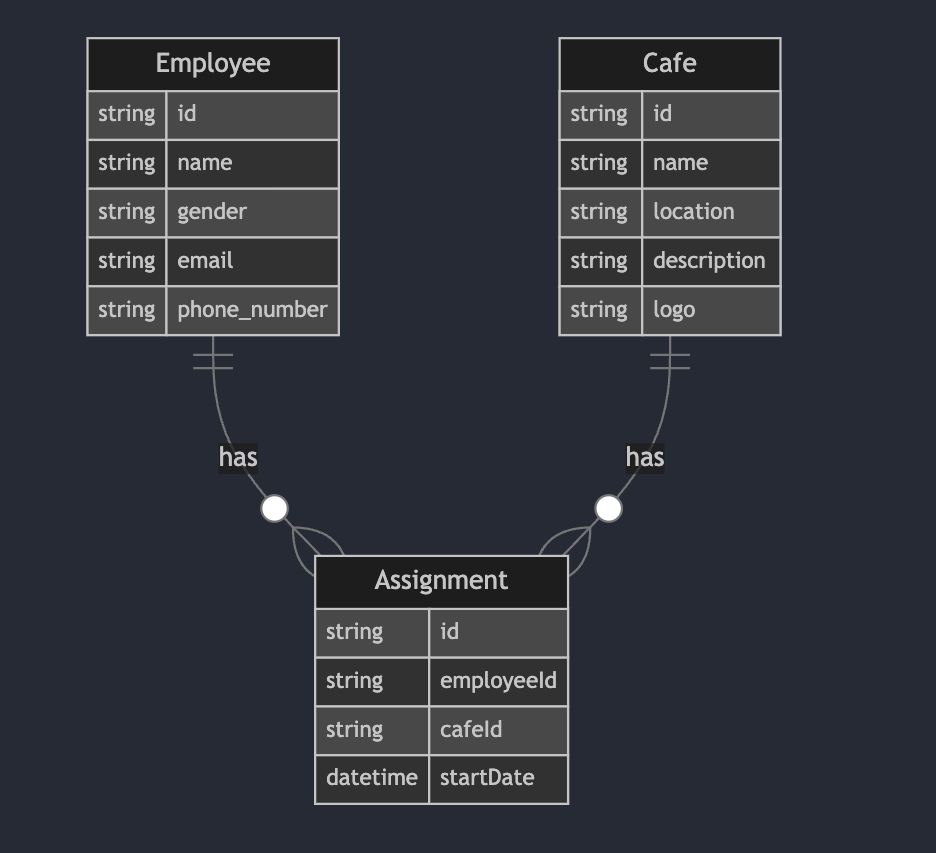

# Cafe Management System

This project manages cafes and their employees, providing a backend built with Node.js and a frontend developed with React.


This application is hosted on Digital Ocean. **Access the live version at [HERE](http://152.42.179.0/)**.


## Entity Relationship Diagram (ERD)



## Prerequisites

- Node.js (v18 or later)
- Docker and Docker Compose
- MySQL (if running without Docker)

## Environment Setup

### Note
- **I have included both `.env` files for both backend and frontend for ease of deployment and testing by other users.**

> **Important:**  I understand that this is not recommended and `.env` should not be uploaded onto Github, especially for production.


---

Create a `.env` file in both the `backend` and `frontend` directories with the following contents based on `example.env` for the required variables:

**Backend `.env`:**

```plaintext
DATABASE_URL=mysql://root:root@db:3306/cafedb
FRONTEND_URL=http://localhost:5173
MYSQL_ROOT_PASSWORD=root
MYSQL_DATABASE=cafedb
```

**Frontend `.env`:**

```plaintext
VITE_BACKEND_URL="http://localhost:3000"
```

## Running with Docker

### Backend

1. Ensure Docker and Docker Compose are installed.
2. Set up the environment variables in the `.env` file.
3. Navigate to the project root directdory (where the `docker-compose.yml` file is located).
4. Run the following command to build and start the containers:


   ```bash
   docker-compose up --build
   ```

5. The backend will be available at `http://localhost:3000`.

### Frontend

The frontend will automatically spin up alongside the backend. Access it at `http://localhost:5173`.

## Running without Docker

### Backend

_Commands except step (1) must be run in `/backend` directory_

1. Create a MySQL database:

   ```bash
   mysql -u root -p 
   -- enter your password ---
   CREATE DATABASE cafedb; # must match the .env
   ```

2. Install dependencies:

   ```bash
   npm install
   ```

3. Generate Prisma client:

   ```bash
   npx prisma generate
   ```

4. Push the database schema:

   ```bash
   npx prisma db push
   ```

5. Seed the database:

   ```bash
   npm run seed
   ```

6. Start the development server:

   ```bash
   npm run start
   ```

### Frontend

_Commands must be run in `/frontend` directory_

1. Install dependencies:

   ```bash
   npm install
   ```

2. Start the development server:

   ```bash
   npm run dev
   ```

## Active API Endpoints with Frontend Interaction

### Cafe Routes

- `GET /api/cafes`: Get all cafes or filter by location
  - Query Parameters:
    - `location` (optional): Filter cafes by location
  - Response: List of cafes sorted by the highest number of employees first

- `POST /api/cafe`: Create a new cafe
  - Body: Cafe details (including logo upload)

- `PUT /api/cafe`: Update a cafe by ID
  - Body: Updated cafe details (including logo upload)

- `GET /api/cafes/:id`: Get a specific cafe by ID

### Employee Routes

- `DELETE /api/employee/:id` Delete an employee by ID

### Assignment Routes

- `GET /api/assignments/employee/:employeeId`: Get assignment record by employee ID
- `GET /api/employees`: Get employees with their assignments

### Management Routes

- `DELETE /api/cafe`: Delete a cafe and its associated data
- `PUT /api/employee`: Update an employee and their assignment
- `POST /api/employee`: Register a new employee for a cafe
  - Creates a new employee in the database and establishes the relationship between the employee and a café.

### Other Routes

- `GET /api`: Hello World test route

### Static File Serving

- `/api/cafe_logos/*`: Serve cafe logo images, falling back to a default logo if the requested logo is not found.

## Database Seeding

The `seed_db.js` script in the `/backend/prisma` directory populates the database with initial data, reading from `seed_data.json` and creating cafes, employees, and random assignments.

## Technologies Used

- **Backend:** Express.js, Prisma ORM, MySQL, Docker, Node.js
- **Frontend:** React.js, Vite, Typescript, Tanstack Query, Tanstack Router, Redux Form, Material UI

---