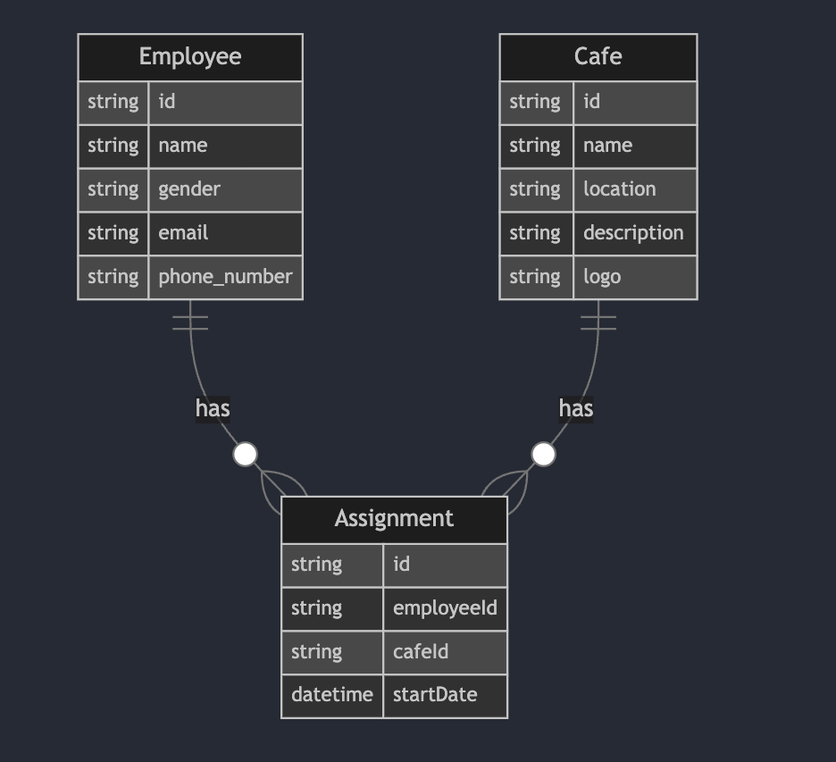

# Cafe Management System Backend

This is the backend for the Cafe Management System, a project that manages cafes and their employees.

## Entity Relationship Diagram (ERD)



## Prerequisites

- Node.js (v18 or later)
- Docker and Docker Compose
- MySQL (if running without Docker)

## Environment Setup

Create a `.env` file in the `backend` directory with the following content:


Adjust the `DATABASE_URL` and `FRONTEND_URL` if you're not using Docker or if you've changed the database credentials.

```bash
DATABASE_URL="mysql://root:root@db:3306/cafedb"
FRONTEND_URL="http://localhost:5173"
```

## Running with Docker

1. Make sure Docker and Docker Compose are installed on your system.
2. Navigate to the project root directory (where the `docker-compose.yml` file is located).
3. Run the following command to build and start the containers:

   ```
   docker-compose up --build
   ```

4. The backend will be available at `http://localhost:3000`.

## Running without Docker

1. Install dependencies:

   ```
   npm install
   ```

2. Generate Prisma client:

   ```
   npx prisma generate
   ```

3. Push the database schema:

   ```
   npx prisma db push
   ```

4. Seed the database:

   ```
   npm run seed
   ```

5. Start the development server:

   ```
   npm run start
   ```

## Active API Endpoints with Frontend Interaction


### Cafe Routes

- `GET /api/cafes`: Get all cafes or filter by location
  - Query Parameters:
    - `location` (optional): Filter cafes by location
  - Response: List of cafes sorted by the highest number of employees first

- `POST /api/cafe`: Create a new cafe
  - Body: Cafe details (including logo upload)

- `PUT /api/cafe`: Update a cafe by ID
  - Body: Updated cafe details (including logo upload)

- `GET /api/cafes/:id`: Get a specific cafe by ID

### Employee Routes

No specific endpoints defined in the provided `employee/route.js` file.

### Assignment Routes

- `GET /api/assignments/employee/:employeeId`: Get assignment record by employee ID

- `GET /api/employees`: Get employees with their assignments

### Management Routes

- `DELETE /api/cafe`: Delete a cafe and its associated data

- `PUT /api/employee`: Update an employee and their assignment

- `POST /api/employee`: Register a new employee for a cafe
  - Creates a new employee in the database
  - Establishes the relationship between the employee and a café

### Other Routes

- `GET /api`: Hello World test route

### Static File Serving

- `/api/cafe_logos/*`: Serve cafe logo images
  - Falls back to a default logo if the requested logo is not found


## Database Seeding

The `seed_db.js` script in the `prisma` directory is used to populate the database with initial data. It reads from `seed_data.json` and creates cafes, employees, and random assignments.

## Project Structure

- `src/`: Contains the main application code
- `prisma/`: Contains Prisma schema and database seeding scripts
- `docker/`: Contains Dockerfile for containerization

## Technologies Used

- Express.js
- Prisma ORM
- MySQL
- Docker
- Node.js